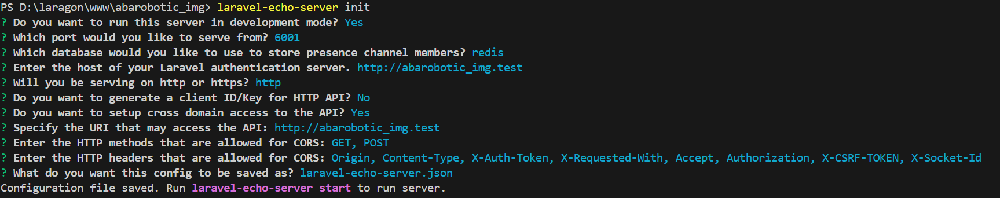
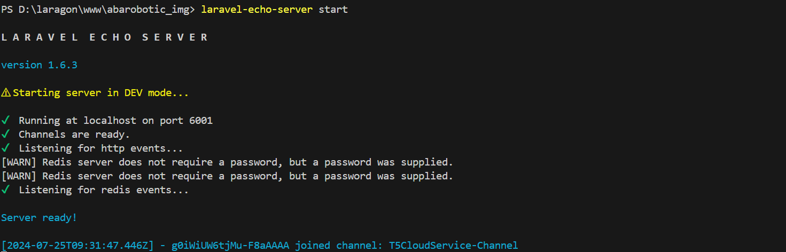

To set up Laravel Echo Server with Nginx or Apache and run it with Supervisor, follow these steps:

### 1. Install Laravel Echo Server

First, ensure you have Node.js and npm installed. Then install Laravel Echo Server globally:

```bash
npm install -g laravel-echo-server
```

### 2. Configure Laravel Echo Server

Create a configuration file for Laravel Echo Server if you don't already have one:

```bash
laravel-echo-server init
```
#### INIT LARAVEL ECHO SERVER



```bash
laravel-echo-server start
```
#### START LARAVEL ECHO SERVER



This will generate a `laravel-echo-server.json` configuration file. Adjust this file according to your needs.

### 3. Run Laravel Echo Server with Supervisor

#### **Install Supervisor**

On Ubuntu, you can install Supervisor with:

```bash
sudo apt-get update
sudo apt-get install supervisor
```

On CentOS, use:

```bash
sudo yum install supervisor
```

#### **Create Supervisor Configuration**

Create a new configuration file for Laravel Echo Server. For example:

```bash
sudo nano /etc/supervisor/conf.d/laravel-echo-server.conf
```

Add the following configuration:

```ini
[program:laravel-echo-server-abarobotic-face]
command=laravel-echo-server start
autostart=true
autorestart=true
user=your_user
stdout_logfile=/var/log/laravel-echo-server-abarobotic-face.log
stderr_logfile=/var/log/laravel-echo-server-abarobotic-face.err.log
```

Replace `your_user` with the appropriate username.

#### **Update Supervisor**

Update Supervisor to recognize the new configuration:

```bash
sudo supervisorctl reread
sudo supervisorctl update
```

Start Laravel Echo Server with:

```bash
sudo supervisorctl start laravel-echo-server-abarobotic-face
```

### 4. Configure Nginx or Apache

#### **Nginx**

1. **Create a New Nginx Configuration File**

   Create a new file in `/etc/nginx/sites-available` (e.g., `laravel-echo-server-abarobotic-face`):

   ```bash
   sudo nano /etc/nginx/sites-available/laravel-echo-server-abarobotic-face
   ```

2. **Add Configuration**

   Add the following configuration:

    **Local Setup**:
    ```nginx
    server {
      listen 6001;
      server_name your_domain_or_ip;

      location / {
          proxy_pass http://127.0.0.1:6001;
          proxy_http_version 1.1;
          proxy_set_header Upgrade $http_upgrade;
          proxy_set_header Connection 'upgrade';
          proxy_set_header Host $host;
          proxy_cache_bypass $http_upgrade;
      }
    }
    ```

    **Remote Setup**:
    ```nginx
    server {
      listen 6001;
      server_name your_domain_or_ip;

      location / {
          proxy_pass http://your_echo_server_ip:6001;
          proxy_http_version 1.1;
          proxy_set_header Upgrade $http_upgrade;
          proxy_set_header Connection 'upgrade';
          proxy_set_header Host $host;
          proxy_cache_bypass $http_upgrade;
      }
    }
    ```

   Replace `your_domain_or_ip` with your domain or IP address.

3. **Enable Configuration**

   Create a symlink to enable the configuration:

   ```bash
   sudo ln -s /etc/nginx/sites-available/laravel-echo-server-abarobotic-face /etc/nginx/sites-enabled/
   ```

4. **Test Nginx Configuration**

   Test the configuration:

   ```bash
   sudo nginx -t
   ```

5. **Restart Nginx**

   Restart Nginx to apply changes:

   ```bash
   sudo systemctl restart nginx
   ```

#### **Apache**

If you prefer Apache, you will need to use the `mod_proxy` module to proxy WebSocket connections.

1. **Enable Required Modules**

   Enable the necessary modules:

   ```bash
   sudo a2enmod proxy
   sudo a2enmod proxy_http
   sudo a2enmod proxy_wstunnel
   ```

2. **Create a New Apache Configuration File**

   Create a new file in `/etc/apache2/sites-available/` (e.g., `laravel-echo-server-abarobotic-face.conf`):

   ```bash
   sudo nano /etc/apache2/sites-available/laravel-echo-server-abarobotic-face.conf
   ```

3. **Add Configuration**

   Add the following configuration:

    **Local Setup**:
    ```apache
    <VirtualHost *:6001>
        ServerName your_domain_or_ip

        ProxyPreserveHost On
        ProxyPass / http://127.0.0.1:6001/
        ProxyPassReverse / http://127.0.0.1:6001/

        <Proxy *>
            Order allow,deny
            Allow from all
        </Proxy>
    </VirtualHost>
    ```

    **Remote Setup**:
    ```apache
    <VirtualHost *:6001>
        ServerName your_domain_or_ip

        ProxyPreserveHost On
        ProxyPass / http://your_echo_server_ip:6001/
        ProxyPassReverse / http://your_echo_server_ip:6001/

        <Proxy *>
            Order allow,deny
            Allow from all
        </Proxy>
    </VirtualHost>
    ```

   Replace `your_domain_or_ip` with your domain or IP address.

4. **Enable Configuration**

   Enable the site:

   ```bash
   sudo a2ensite laravel-echo-server-abarobotic-face.conf
   ```

5. **Restart Apache**

   Restart Apache to apply changes:

   ```bash
   sudo systemctl restart apache2
   ```

By following these steps, you should have Laravel Echo Server running and accessible through Nginx or Apache, with Supervisor managing the process.